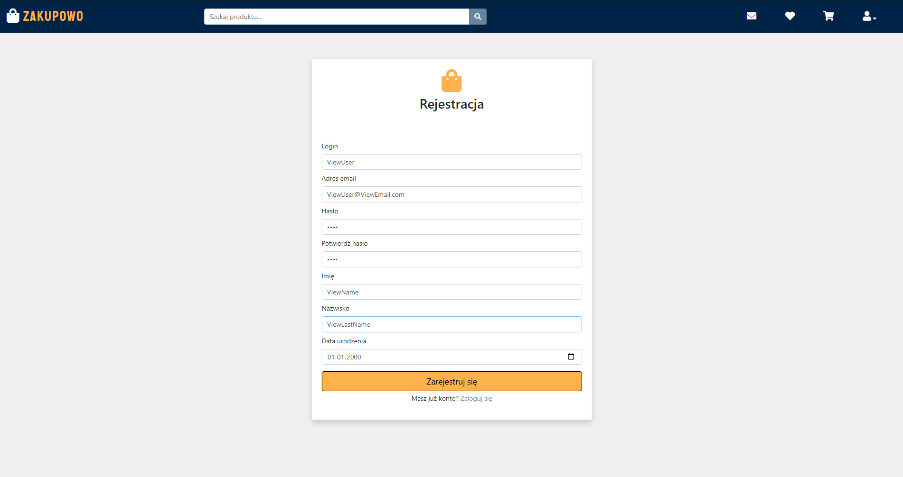
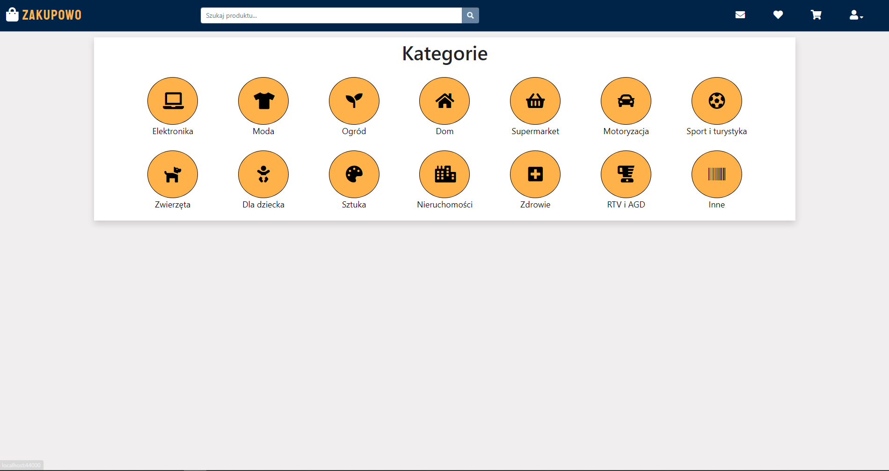
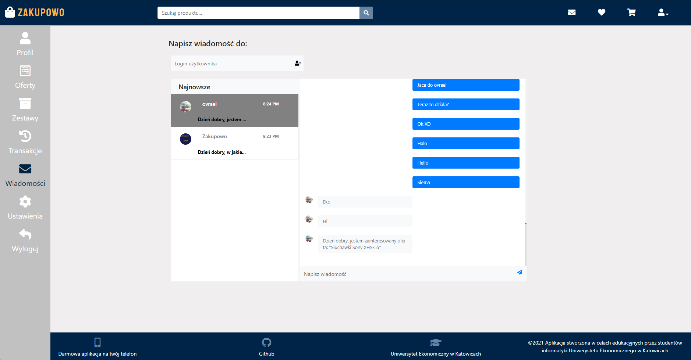

# Zakupowo site

> Welcome to our trade website, where you can:
>  * Browse users' offers and bundles. 
>  * Make your own offers and bundles.
>  * Manage your account to simplify buying process.
>  
 Enjoy shoppin'!

## Content

Check the webiste! http://zakupowo.azurewebsites.net/

- [Zakupowo site](#Zakupowo-site)
  - [Content](#Content)
  - [General info](#general-info)
  - [Screenshots](#screenshots)
  - [Technologies](#technologies)
  - [Features](#features)
  - [Status](#status)
  - [Inspiration](#inspiration)
  - [Our team!](#Our-team!)

## General info

This is our academic project which is made using agile working. Our purpose is to make fully working site where users make buy / sell transactions. 

## Screenshots

## Technologies

Front-end:
* HTML v 5.0
* Bootstrap v 4.5.3
* CSS v 3.0

Back-end:
* C# v 8.0
* .Net Framework v 4.7.2
* IISExpress
* Entity framework v 6.1.3
* SignalR v 2.4.1
* Croppie v 2.6.5
* MimeKit v 2.10.0
* AJAX

Cloud:
* Azure Database
* Azure Blobs
* GitHub

Mobile App:
* Xamarin.Forms framework

## Features

* 14 different categories
* Browsing offers and bundles
* Favourites system
* Creating offers and bundles (with discounts)
* Transactions system
* Cummunicator

## Status

Project is: _in progress_.

That means it is unfinished and we are still working on its functionalities.

## Our team!

* [Jacek Jendrzejewski](https://jacek-jendrzejewski.azurewebsites.net) (back-end, Azure manager)
* [Piotr Kaczka](https://github.com/P3rf3cT12) (back-end, database manager)
* [Kamil Jonak](kamreo.github.io/portfolio-website/) (back-end, mobile app)
* [Sławomir Perlak](https://github.com/perlak99) (front-end)
* [Dominika Pietrzyk](https://github.com/DominikaPietrzyk) (front-end)
